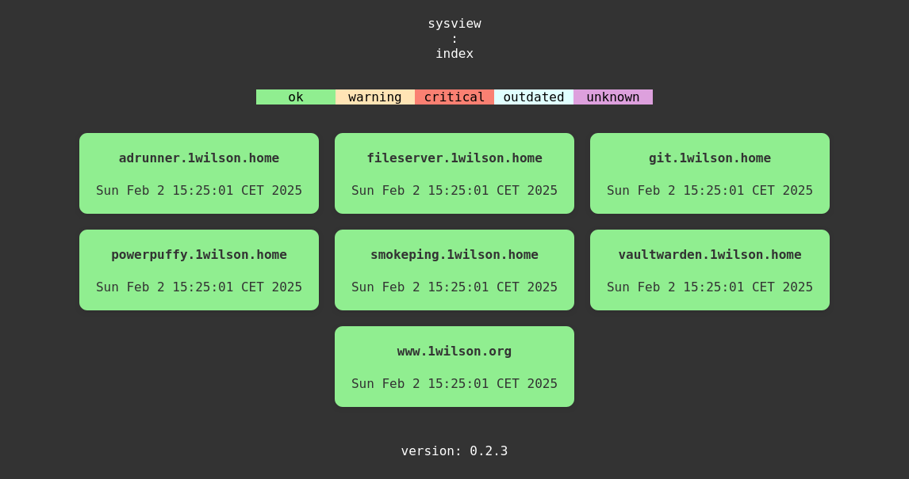
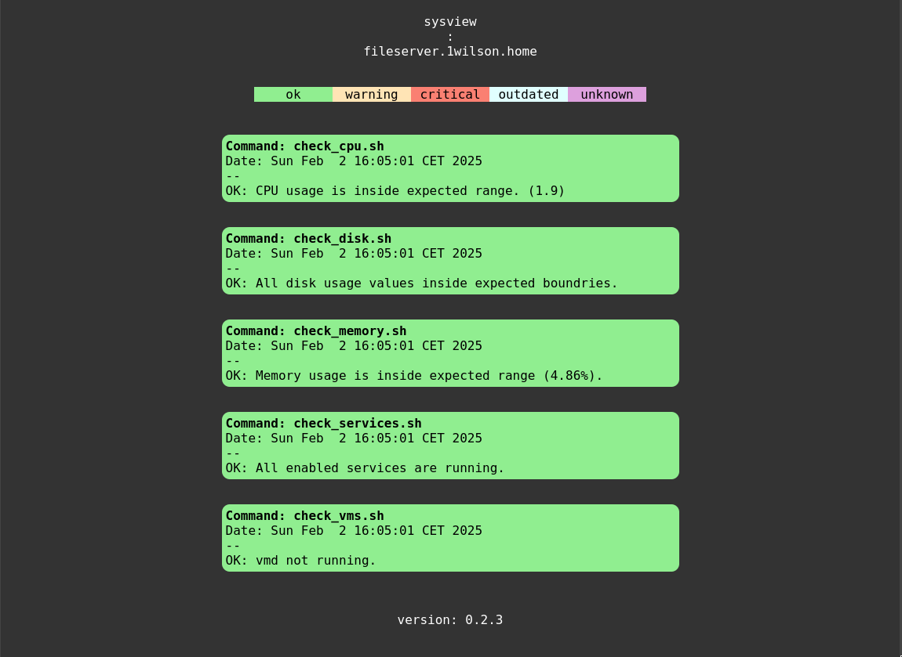

# sysview

sysview generates static html monitoring dashboards from
[sysreport](https://github.com/torarg/sysreport)
compliant reports received on stdin.

The generated files are written to a given output directory.

## screenshots
### index view

### detail view

## requirements
- POSIX compliant shell
- tested only with OpenBSD userland tools (date, find, sed, ...)

## documentation
[sysview (1)](docs/sysview.md)
