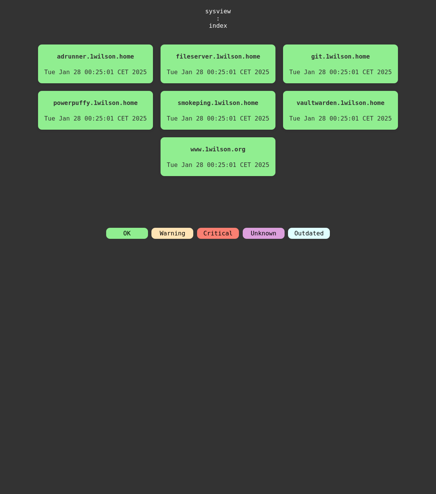
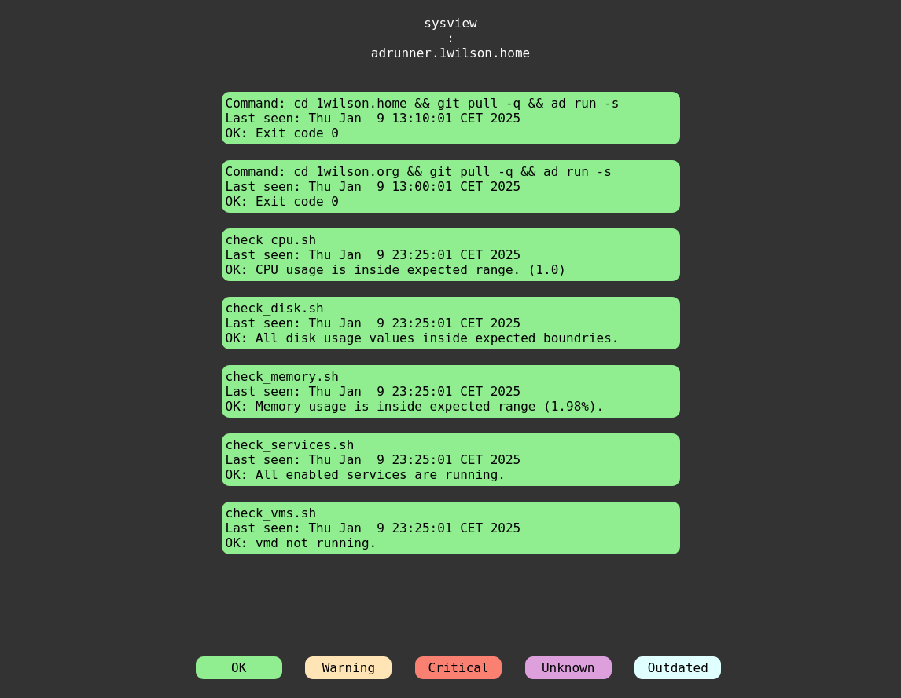

# sysview

sysview generates a simple monitoring dashboard from
[sysreport](https://github.com/torarg/sysreport) compliant reports.

Reports are received via STDIN and sysview then re(generates) the detail
view for the host specified in the received report. Also it re(generates) the
index page from it's cache and marks report items older than one day as outdated.

index view


detail view


## requirements
- POSIX compliant shell
- tested only with OpenBSD userland tools (date, find, sed, ...)


## usage
sysview expects it's input on STDIN and then creates or updates the
specified html root. 

To add or update a hosts ``sysreport`` on a remote
web server's sysview dashboard:
```
sysreport | ssh www sysview /var/www/htdocs/sysview
```

``sysreport`` also includes ``reportify`` which allows you to quickly
reportify a commands output. 

To report a backup job's status back to sysview and surpress any stdout
when the command's exit code is zero:
```
reportify -s -t backup -c "/usr/local/bin/backup.sh" | ssh www sysview /var/www/htdocs/pub/sysview
```

## report format

sysview expects a ``sysreport`` compliant report on STDIN.

Report with one item:
```
Hostname: HOSTNAME
Date: DATE
Type: REPORT_TYPE
---
ITEM_TITLE
STATUS: STATUS_MESSAGE
OPTIONAL_ADDITIONAL_OUTPUT
```

Report with multiple items:
```
Hostname: HOSTNAME
Date: DATE
Type: REPORT_TYPE
---
ITEM_TITLE
STATUS: STATUS_MESSAGE
OPTIONAL_ADDITIONAL_OUTPUT
---
ITEM_TITLE
STATUS: STATUS_MESSAGE
OPTIONAL_ADDITIONAL_OUTPUT
```

